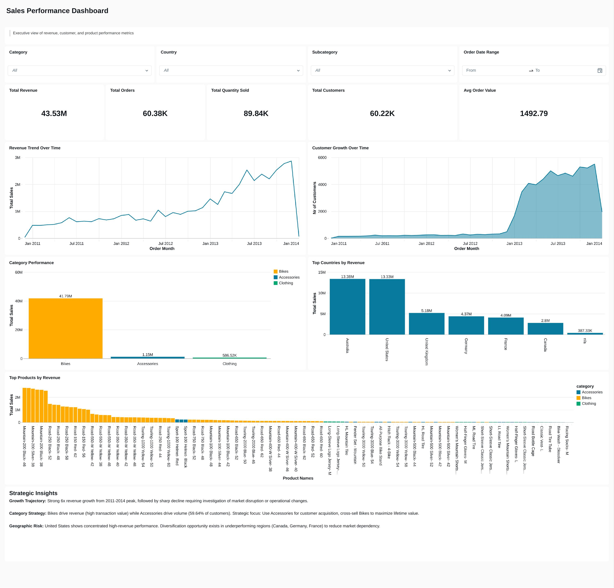
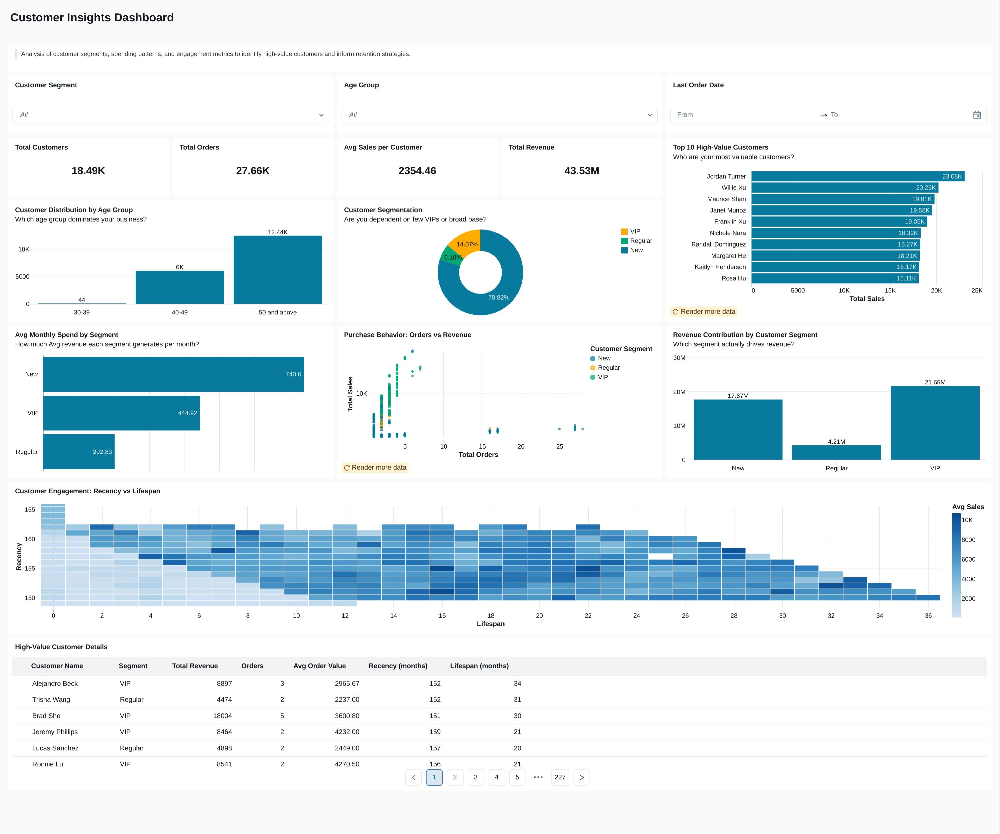

# 📊 Databricks Lakehouse Sales Analytics (End-to-End BI Workflow)

## 🔍 Overview

This project demonstrates an end-to-end analytics workflow using Databricks, simulating how modern data teams operate on a Lakehouse architecture.

The goal is to explore raw data, generate business insights, build dashboards, and enable natural language querying using AI.

---

## 🏗️ Architecture

| Layer | Description |
|-------|-------------|
| **Bronze** | Raw CSV data ingested as-is into Databricks |
| **Silver** | Cleaned and conformed tables (type casting, null handling, deduplication) |
| **Gold** | Business-ready Star Schema powering dashboards and analytics |

**Data Platform:** Databricks Lakehouse  
**Data Model:** Star Schema (`fact_sales` + `dim_customers` + `dim_products`)

```
fact_sales
  ├── customer_key → dim_customers
  └── product_key  → dim_products
```

---

## 📂 Repository Structure

```
04-databricks-lakehouse-sales-analytics-bi/
│
├── analytics_datasets/
│   ├── sales_dataset/
│   │   ├── fact_sales.csv         # ~60K rows of transactional sales data
│   │   ├── dim_customers.csv      # ~18K customer records
│   │   └── dim_products.csv       # ~295 products
│   └── hr_dataset/
│       └── dataset.csv
│
├── sql_scripts/
│   ├── phase_1_data_exploration.dbquery.ipynb   # EDA, KPIs, trends
│   └── phase_2_sales_dashboard_data.dbquery.ipynb  # Gold-layer CTE for dashboards
│
├── databricks_dashboards/
│   ├── images/    # Dashboard screenshots
│   ├── json/      # Importable Databricks dashboard definitions
│   └── pdf/       # PDF exports
│
└── README.md
```

---

## 🗂️ Data Dictionary

### `fact_sales` (~60K rows)

| Column | Type | Description |
|--------|------|-------------|
| `order_number` | string | Unique order identifier |
| `product_key` | int | FK to `dim_products` |
| `customer_key` | int | FK to `dim_customers` |
| `order_date` | date | Date order was placed |
| `shipping_date` | date | Date order was shipped |
| `due_date` | date | Expected delivery date |
| `sales_amount` | decimal | Revenue from the order line |
| `quantity` | int | Units ordered |
| `price` | decimal | Unit price |

### `dim_customers` (~18K rows)

| Column | Type | Description |
|--------|------|-------------|
| `customer_key` | int | Surrogate key (PK) |
| `customer_id` | int | Source system customer ID |
| `customer_number` | string | Business customer number |
| `first_name` | string | First name |
| `last_name` | string | Last name |
| `country` | string | Country of residence |
| `marital_status` | string | Marital status |
| `gender` | string | Gender |
| `birthdate` | date | Date of birth |
| `create_date` | date | Account creation date |

### `dim_products` (~295 rows)

| Column | Type | Description |
|--------|------|-------------|
| `product_key` | int | Surrogate key (PK) |
| `product_id` | int | Source system product ID |
| `product_number` | string | Business product number |
| `product_name` | string | Full product name |
| `category` | string | Top-level category (e.g. Technology) |
| `subcategory` | string | Sub-level classification |
| `cost` | decimal | Product cost |
| `product_line` | string | Product line grouping |
| `start_date` | date | Product availability start date |

---

## 🔍 Phase 1: Data Exploration (SQL)

Performed detailed exploratory analysis using Databricks SQL Editor.

**Key Analysis:**
- Schema inspection (`DESCRIBE TABLE`)
- Core KPIs: Total Sales, Orders, Customers, Quantity
- Product hierarchy (Category → Subcategory → Product)
- Sales and order trends over time
- Category-wise and geography-wise performance

📁 Script: [`sql_scripts/phase_1_data_exploration.dbquery.ipynb`](sql_scripts/phase_1_data_exploration.dbquery.ipynb)

---

## 📊 Phase 2: Dashboard Data Preparation (SQL)

A production-grade multi-level CTE query that powers the Sales Performance Dashboard.

**CTE Structure:**

```
base_query        → Optimised joins across fact + dims
aggregated        → Monthly/country/category aggregations
category_metrics  → Pre-computed category totals
overall_metrics   → Pre-computed overall totals (broadcast via CROSS JOIN)
final             → Derived KPIs: AOV, % customers by category, country rank
```

📁 Script: [`sql_scripts/phase_2_sales_dashboard_data.dbquery.ipynb`](sql_scripts/phase_2_sales_dashboard_data.dbquery.ipynb)

---

## 📊 Sales Performance Dashboard

### Key Metrics
- Total Sales | Total Profit | Total Quantity | Average Order Value

### Visuals
- Monthly Sales Trend (Line Chart)
- Sales by Category (Bar Chart)
- Country-level Revenue Ranking
- KPI Summary Cards

### Key Insights
- Technology category contributes the highest revenue
- Sales show clear monthly trends indicating seasonality
- A few categories dominate overall revenue contribution

<p align="center">
  
</p>

---

## 👥 Customer Insights Dashboard

### Key Metrics
- Total Customers | Average Sales per Customer | Total Orders

### Visuals
- Orders by Age Group
- Top 10 Customers by Sales
- Customer Distribution by Country

### Key Insights
- A small group of customers contributes a large share of revenue (Pareto principle)
- The Adult age group drives the majority of orders
- High-value customers can be targeted for retention strategies

<p align="center">
  
</p>

---

## 🤖 AI-Powered Analytics (Databricks Genie)

Implemented natural language querying using **Databricks Genie**.

**Sample Questions Tested:**
- Top 5 customers by sales
- Sales trend over last 6 months
- Which category generated highest profit?
- Orders distribution by age group

**Approach:**
- Reviewed AI-generated SQL queries
- Identified incorrect joins and aggregations
- Refined Genie instructions for improved accuracy

**Key Learning:** AI-generated insights must always be validated with domain knowledge and proper data modeling.

---

## 🧠 Key Business Insights

- **Technology** is the primary revenue driver across all categories
- **Customer revenue** follows the Pareto principle — top customers drive majority of sales
- **Seasonality** is evident in monthly sales trends
- **Customer segmentation** by age group and geography can improve targeted marketing

---

## 🛠️ Tools & Technologies

| Tool | Usage |
|------|-------|
| Databricks SQL | Data exploration & transformation |
| Databricks Dashboards | Business intelligence visualisation |
| Databricks Genie | Natural language AI querying |
| Lakehouse (Delta Lake) | Storage & compute architecture |
| Star Schema | Data modelling approach |

---

## 🚀 How to Run This Project

1. Upload CSVs from `analytics_datasets/` into Databricks (DBFS or Unity Catalog volume)
2. Create Bronze → Silver → Gold tables using the medallion pattern
3. Open SQL Editor and run scripts from `sql_scripts/` in order (phase 1 then phase 2)
4. Import dashboard JSON files from `databricks_dashboards/json/` into your workspace
5. Enable Genie AI and connect to the Gold schema to test natural language queries

---

## 🙌 Acknowledgement

This project is based on a hands-on analytics workflow inspired by the training and guidance provided by **Baraa Khatib**.

His structured approach to teaching Databricks, SQL, dashboards and real-world analytics use cases helped shape the foundation of this project. This implementation represents my own hands-on work, adaptations, and business-oriented enhancements.

---

## 📢 Connect With Me

If you found this useful or want to collaborate, feel free to connect on LinkedIn.

[](https://www.linkedin.com/in/mohammed-afzal-shariff/)
